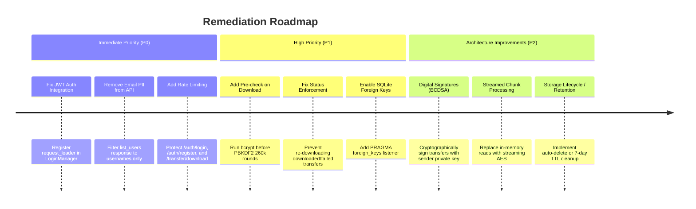

# Backend Security Audit & Vulnerability Assessment Report
**Project:** File Transfer System Using ECC (Flask + NIST P-256 + AES-256-GCM)  
**Scope:** Complete Backend Codebase (`app/`, `config.py`, `run.py`)  
**Audit Date:** 2026-09-29  
**Assessment Type:** Static Code Analysis, Cryptographic Review & Architecture Audit  

---

## Executive Summary

A comprehensive architectural and security audit of the backend was conducted across authentication, cryptographic operations, file handling, and database integrity. While the cryptographic primitives chosen (NIST P-256, AES-256-GCM, PBKDF2-SHA256, HKDF-SHA256) are mathematically sound, several **critical architectural vulnerabilities**, **authorization disconnects**, **denial-of-service risks**, and **application bugs** exist that undermine system security and stability.

### Findings Breakdown
| Severity | Count | Primary Focus Areas |
| :--- | :---: | :--- |
| 🔴 **Critical** | **4** | Unauthenticated Transfers, Broken JWT Layer, Plaintext Password in Download, PBKDF2 DoS |
| 🟠 **High** | **5** | PII Leak in API, Memory Exhaustion (OOM), Unbounded Disk Leak, State Replay, JWT Invalidation |
| 🟡 **Medium** | **6** | Browser UX Breakdown, SQLite Foreign Key Orphanage, Unicode Rejection, Bcrypt Truncation, User Enumeration, Missing AAD |
| 🟢 **Low / Info** | **5** | Insecure Fallback Secrets, DB/Filesystem Race Conditions, Deprecated APIs, Missing Pagination |

---

## Detailed Findings

```mermaid
graph TD
    subgraph Client
        Browser[Browser Client / SPA]
    end

    subgraph AuthLayer[Authentication & Session Layer]
        JWT[JWT Bearer Header]
        SessionCookie[Flask-Login Session Cookie]
        LoginReq[@login_required - ignores Bearer!]
    end

    subgraph CryptoTransfer[Crypto & Transfer Core]
        ECIES[ECIES Ephemeral ECDH - Unsigned!]
        AES[AES-256-GCM - In-Memory Full Buffer]
        PBKDF2[PBKDF2 260k Rounds on Download]
    end

    subgraph Storage[Storage & DB]
        DB[(SQLite / SQL DB)]
        Disk[(uploads/ Folder - No Cleanup)]
    end

    Browser -->|Bearer Token| LoginReq
    LoginReq -.->|Fails 401!| Browser
    Browser -->|Password in JSON| PBKDF2
    Browser -->|Upload 100MB| AES
    AES -->|Full RAM write| Disk
```

---

## 1. 🔴 Critical Severity Vulnerabilities

### C1: Unauthenticated ECIES File Transfers (Missing Digital Signatures)
* **File:** [app/crypto/ecc.py](file:///c:/Users/pc/OneDrive/Desktop/FIle%20Transfer/file_transfer_ecc/app/crypto/ecc.py#L254-L309), [app/transfer/routes.py](file:///c:/Users/pc/OneDrive/Desktop/FIle%20Transfer/file_transfer_ecc/app/transfer/routes.py#L111-L148)
* **Description:**  
  In `ecies_encrypt_session_key`, an ephemeral ECC key pair `(ephemeral_priv, ephemeral_pub)` is generated, and ECDH is computed against the recipient's public key. However, the sender **never cryptographically signs** the ephemeral public key, the file hash, or the encrypted session key using their registered ECC private key (e.g. via ECDSA).
* **Impact:**
  - **No Authenticity & No Non-Repudiation:** Cryptographically, any party with access to the recipient's public key can generate an ephemeral key pair and wrap a session key. The recipient has no cryptographic proof that the file was generated or approved by `sender_id`.
  - **Tampering / Injection:** If an attacker modifies the database or injects a record, they can forge transfers that appear to come from any user without possessing that user's private key.
* **Remediation:**  
  Implement ECDSA digital signatures using the sender's private key to sign `SHA256(ephemeral_public_key || plaintext_sha256 || recipient_id)`. Store the signature on the `Transfer` model and verify it before releasing the file during download.

---

### C2: JWT Authentication Disconnect & Broken API Authorization
* **File:** [app/auth/jwt.py](file:///c:/Users/pc/OneDrive/Desktop/FIle%20Transfer/file_transfer_ecc/app/auth/jwt.py#L141-L175), [app/transfer/routes.py](file:///c:/Users/pc/OneDrive/Desktop/FIle%20Transfer/file_transfer_ecc/app/transfer/routes.py#L60), [app/main/routes.py](file:///c:/Users/pc/OneDrive/Desktop/FIle%20Transfer/file_transfer_ecc/app/main/routes.py#L55), [app/auth/routes.py](file:///c:/Users/pc/OneDrive/Desktop/FIle%20Transfer/file_transfer_ecc/app/auth/routes.py#L260-L308)
* **Description:**  
  While `jwt_required` was implemented in `app/auth/jwt.py`, **not a single route** in `transfer/routes.py`, `main/routes.py`, or `auth/routes.py` actually uses `@jwt_required`. Instead, every protected endpoint is decorated with Flask-Login's `@login_required` and references `current_user`.
  Furthermore, `login_manager` in `app/__init__.py` has no `request_loader`. It only inspects session cookies.
* **Impact:**  
  Any external API client, mobile client, or frontend fetch request that provides `Authorization: Bearer <token>` without a session cookie is rejected with `401 Unauthorized`. The app only works in browser because `login_user()` sets a session cookie at the same time.
* **Remediation:**  
  Register a `@login_manager.request_loader` in [app/__init__.py](file:///c:/Users/pc/OneDrive/Desktop/FIle%20Transfer/file_transfer_ecc/app/__init__.py) that reads `Authorization: Bearer <token>` and validates the JWT, or unify authentication so `current_user` is populated transparently from either JWT or Session cookies.

---

### C3: Plaintext Password Transmitted on File Download
* **File:** [app/transfer/routes.py](file:///c:/Users/pc/OneDrive/Desktop/FIle%20Transfer/file_transfer_ecc/app/transfer/routes.py#L206-L230), [app/transfer/utils.py](file:///c:/Users/pc/OneDrive/Desktop/FIle%20Transfer/file_transfer_ecc/app/transfer/utils.py#L188-L230)
* **Description:**  
  To download and decrypt a file, `POST /transfer/download/<transfer_id>` requires the user to send their **raw plaintext login password** in the JSON payload (`{"password": "..."}`). The server passes this password into `recover_private_key`, which runs PBKDF2 to derive the AES wrapping key that decrypts the stored ECC private key.
* **Impact:**
  - Every download operation exposes the user's master password to the application runtime, network transport layer, reverse proxy logs (if query strings or POST logs are enabled), and memory dumps.
  - **Password Change Impossibility:** If a user ever changes their account password, all previously encrypted private keys become permanently undecryptable because they are wrapped with the old password.
* **Remediation:**  
  Decouple key protection from the user's raw password. Either:
  1. Derive a dedicated key encryption key (KEK) on user login and keep it in the authenticated session/vault, or
  2. Implement client-side key recovery where the private key is held or decrypted client-side in the browser via Web Crypto API.

---

### C4: Denial of Service via PBKDF2 Computational Flooding
* **File:** [app/transfer/routes.py](file:///c:/Users/pc/OneDrive/Desktop/FIle%20Transfer/file_transfer_ecc/app/transfer/routes.py#L224-L239), [app/crypto/kdf.py](file:///c:/Users/pc/OneDrive/Desktop/FIle%20Transfer/file_transfer_ecc/app/crypto/kdf.py#L27-L73)
* **Description:**  
  `PBKDF2_ITERATIONS` is set to 260,000 rounds. When a download request arrives, `decrypt_and_verify` invokes `recover_private_key` immediately **without checking whether the password matches `user.password_hash` via bcrypt first**.
* **Impact:**  
  Any authenticated recipient can send hundreds of rapid POST requests to `/transfer/download/<id>` with random or incorrect passwords. Each request consumes substantial CPU cycles executing 260,000 SHA-256 iterations. With no rate limiting, this starves server CPU workers and brings the entire Flask server to a halt.
* **Remediation:**  
  1. Add rate limiting (e.g. `Flask-Limiter`).
  2. Verify the password against `bcrypt.check_password_hash` *before* initiating the expensive PBKDF2 calculation.

---

## 2. 🟠 High Severity Vulnerabilities & Architecture Bugs

### H1: Sensitive PII (Email) Leak in User Directory API
* **File:** [app/auth/routes.py](file:///c:/Users/pc/OneDrive/Desktop/FIle%20Transfer/file_transfer_ecc/app/auth/routes.py#L326-L330)
* **Code Reference:**
  ```python
  return jsonify({
      "status": "success",
      "users": [{"id": u.id, "user_id": u.id, "username": u.username, "email": u.email} for u in users],
      "total": len(users),
  }), 200
  ```
* **Description:**  
  While the frontend UI was updated to show only usernames, the backend endpoint `GET /auth/users/list` (and `/auth/users`) continues to serialize and transmit `email` for every registered user in the database.
* **Impact:** Any registered user can dump the full directory of user emails, leading to corporate espionage, phishing campaigns, or privacy compliance violations (GDPR).
* **Remediation:** Remove `"email": u.email` from the response dictionary.

---

### H2: Memory Exhaustion (OOM) via Full-Buffer File Handling
* **File:** [app/transfer/utils.py](file:///c:/Users/pc/OneDrive/Desktop/FIle%20Transfer/file_transfer_ecc/app/transfer/utils.py#L88-L154), [app/transfer/routes.py](file:///c:/Users/pc/OneDrive/Desktop/FIle%20Transfer/file_transfer_ecc/app/transfer/routes.py#L105-L295)
* **Description:**  
  The maximum file size is configured to **100 MB** (`MAX_CONTENT_LENGTH_MB = 100`). During upload:
  1. `file.read()` loads 100 MB into RAM for size checking in `validate_file`.
  2. `file.seek(0); file.read()` loads 100 MB into RAM again in `send_file_transfer`.
  3. `encrypt_bytes()` processes the entire 100 MB in memory into a 100 MB ciphertext buffer.
  During download:
  4. `open().read()` loads 100 MB ciphertext into RAM.
  5. `decrypt_bytes()` generates 100 MB plaintext in RAM.
  6. `io.BytesIO(plaintext)` allocates an additional 100 MB RAM buffer.
* **Impact:** A single download of a 100 MB file consumes ~300 MB of process memory. A handful of concurrent transfers will trigger an Out-Of-Memory (OOM) killer on typical 1GB–2GB cloud VPS instances.
* **Remediation:** Use chunked streaming encryption/decryption (e.g. `cryptography` streaming AES-GCM or AES-CTR with HMAC) and stream files directly to/from disk using Python generators and `Response(stream_with_context(...))`.

---

### H3: Unbounded Disk Space Growth & Missing File Lifecycle Management
* **File:** [app/transfer/routes.py](file:///c:/Users/pc/OneDrive/Desktop/FIle%20Transfer/file_transfer_ecc/app/transfer/routes.py#L285-L286), [app/transfer/routes.py](file:///c:/Users/pc/OneDrive/Desktop/FIle%20Transfer/file_transfer_ecc/app/transfer/routes.py#L484-L490)
* **Description:**  
  1. Auto-deletion after download is commented out (`# delete_stored_file(...)`).
  2. `delete_transfer` explicitly forbids the sender from deleting already-downloaded files (`if transfer.status == TransferStatus.DOWNLOADED: return 422`).
  3. Receivers have **no delete endpoint** whatsoever.
* **Impact:** Once a file is downloaded, it is permanently locked on server disk and database. Neither sender nor receiver can delete it. The server disk fills monotonically over time until exhaustion.
* **Remediation:**  
  Allow either sender or receiver to delete downloaded transfers, or implement an automated expiration/retention policy (e.g. 7-day TTL background cleanup job).

---

### H4: Download Route Ignores Transfer Status (State Replay & Broken Burn-After-Reading)
* **File:** [app/transfer/routes.py](file:///c:/Users/pc/OneDrive/Desktop/FIle%20Transfer/file_transfer_ecc/app/transfer/routes.py#L186-L283)
* **Description:**  
  `download_file` never checks `transfer.status`. If a transfer was already marked `DOWNLOADED` or even marked `FAILED` (e.g. due to prior tampering or corrupted block), the endpoint still attempts decryption and returns the file.
* **Impact:** No enforcement of single-download transfers. If an attacker gains temporary access to a compromised recipient session, they can re-harvest historical transfers.
* **Remediation:** Add a check `if transfer.status != TransferStatus.PENDING: return jsonify({"status": "error", "message": "Transfer is no longer available"}), 410`.

---

### H5: Long-Lived JWT Tokens Without Revocation Mechanism
* **File:** [app/auth/jwt.py](file:///c:/Users/pc/OneDrive/Desktop/FIle%20Transfer/file_transfer_ecc/app/auth/jwt.py#L39-L63), [app/config.py](file:///c:/Users/pc/OneDrive/Desktop/FIle%20Transfer/file_transfer_ecc/app/config.py#L78-L83)
* **Description:**  
  Access tokens expire in **7 days** and refresh tokens in **30 days**. Tokens are stored in `localStorage` (accessible to JavaScript / XSS). When a user clicks "Logout", `POST /auth/logout` only calls `logout_user()` (Flask-Login session). The JWT tokens remain completely valid.
* **Impact:** If a JWT token is intercepted or copied from localStorage, an attacker retains full API access for 7 days even if the legitimate user logs out or changes their password.
* **Remediation:**  
  1. Reduce access token lifetime to 15–60 minutes.
  2. Implement a token blocklist in Redis/database or include a `token_version` column on the `User` model. Increment `token_version` upon logout or password reset.

---

## 3. 🟡 Medium Severity Vulnerabilities & Logic Bugs

### M1: Global Error Handlers Break Browser UX
* **File:** [app/__init__.py](file:///c:/Users/pc/OneDrive/Desktop/FIle%20Transfer/file_transfer_ecc/app/__init__.py#L68-L76), [app/__init__.py](file:///c:/Users/pc/OneDrive/Desktop/FIle%20Transfer/file_transfer_ecc/app/__init__.py#L124-L148)
* **Description:**  
  `@login_manager.unauthorized_handler` and HTTP error handlers (400, 403, 404, 500) unconditionally return JSON objects:
  ```python
  @login_manager.unauthorized_handler
  def unauthorized():
      return jsonify({"status": "error", "message": "Authentication required.", "code": 401}), 401
  ```
* **Impact:** If an unauthenticated user enters `http://localhost:5000/dashboard` in their browser, instead of being redirected to `/auth/login`, they see a raw JSON error string. If they type a wrong URL, they see a raw JSON 404.
* **Remediation:** Inspect `request.accept_mimetypes.accept_html` and redirect to `url_for('auth.login')` or render HTML error templates for browser requests, returning JSON only for API clients.

---

### M2: SQLite Foreign Key Constraints Are Not Enforced
* **File:** [app/models/ecc_key.py](file:///c:/Users/pc/OneDrive/Desktop/FIle%20Transfer/file_transfer_ecc/app/models/ecc_key.py#L38-L45), [app/models/transfer.py](file:///c:/Users/pc/OneDrive/Desktop/FIle%20Transfer/file_transfer_ecc/app/models/transfer.py#L52-L65)
* **Description:**  
  Both `ECCKey` and `Transfer` define `ondelete="CASCADE"` on their foreign keys to `User`. However, SQLite disables foreign key enforcement by default. SQLAlchemy does not enable it automatically.
* **Impact:** Deleting a user in SQLite does **not** trigger cascade deletes. It leaves orphaned `ecc_keys` and `transfers` in the database, corrupting relational integrity.
* **Remediation:** Add an engine connect listener in `app/__init__.py`:
  ```python
  from sqlalchemy import event
  from sqlalchemy.engine import Engine

  @event.listens_for(Engine, "connect")
  def set_sqlite_pragma(dbapi_connection, connection_record):
      cursor = dbapi_connection.cursor()
      cursor.execute("PRAGMA foreign_keys=ON")
      cursor.close()
  ```

---

### M3: Unicode Filename Upload Rejection
* **File:** [app/transfer/utils.py](file:///c:/Users/pc/OneDrive/Desktop/FIle%20Transfer/file_transfer_ecc/app/transfer/utils.py#L74-L77)
* **Description:**  
  `validate_file` runs `original_name = secure_filename(file.filename)`. `werkzeug.utils.secure_filename` strips all non-ASCII characters.
* **Impact:** If a user uploads a file with non-Latin characters (e.g. `تقرير.pdf`, `документ.docx`, `résumé.pdf`, or `विवरण.txt`), `secure_filename` strips the text, resulting in empty filename or extension-only name, triggering `FileValidationError("Invalid filename.")`.
* **Remediation:** Preserve the original sanitized display name in `original_filename` while using a UUID or safe ASCII slug for internal storage.

---

### M4: Bcrypt Silent 72-Byte Password Truncation
* **File:** [app/auth/forms.py](file:///c:/Users/pc/OneDrive/Desktop/FIle%20Transfer/file_transfer_ecc/app/auth/forms.py#L59-L62), [app/auth/utils.py](file:///c:/Users/pc/OneDrive/Desktop/FIle%20Transfer/file_transfer_ecc/app/auth/utils.py#L40)
* **Description:**  
  The registration form permits passwords up to 128 characters: `Length(min=8, max=128)`. However, the underlying Bcrypt hashing algorithm natively truncates all passwords at 72 bytes.
* **Impact:** A password with 72 characters followed by `ABC` has the exact same hash as that password followed by `XYZ`. Users entering long passwords have false confidence in entropy beyond 72 bytes.
* **Remediation:** Either restrict form max length to 72 characters, or pre-hash passwords using SHA-256 before feeding into Bcrypt.

---

### M5: User Enumeration via Registration & Authentication Responses
* **File:** [app/auth/forms.py](file:///c:/Users/pc/OneDrive/Desktop/FIle%20Transfer/file_transfer_ecc/app/auth/forms.py#L90-L98)
* **Description:**  
  Form validation errors explicitly state:
  - `"This username is already taken. Please choose another."`
  - `"An account with this email already exists. Please log in."`
* **Impact:** Unauthenticated attackers can probe registration endpoints to build a verified list of active usernames and email addresses.
* **Remediation:** Use generic responses on public registration or return standardized validation hints.

---

### M6: Lack of Authenticated Associated Data (AAD) in AES-GCM
* **File:** [app/crypto/aes.py](file:///c:/Users/pc/OneDrive/Desktop/FIle%20Transfer/file_transfer_ecc/app/crypto/aes.py#L93), [app/crypto/aes.py](file:///c:/Users/pc/OneDrive/Desktop/FIle%20Transfer/file_transfer_ecc/app/crypto/aes.py#L140)
* **Description:**  
  `aesgcm.encrypt(nonce, plaintext, None)` and `aesgcm.decrypt(nonce, ciphertext_with_tag, None)` pass `None` for the `associated_data` parameter.
* **Impact:** Ciphertext is not cryptographically bound to its metadata. An attacker with database modification rights could transplant a valid ciphertext from Transfer A to Transfer B without detection by GCM tag verification.
* **Remediation:** Bind `transfer_id.encode()` and `recipient_id.to_bytes()` into the AES-GCM Associated Data.

---

## 4. 🟢 Low Severity & Code Quality Issues

| ID | Issue | Location | Impact | Recommendation |
| :--- | :--- | :--- | :--- | :--- |
| **L1** | **Insecure Default Secret Keys** | [app/config.py:26-28](file:///c:/Users/pc/OneDrive/Desktop/FIle%20Transfer/file_transfer_ecc/app/config.py#L26-L28) | If deployed without `.env`, falls back to known defaults. | In `ProductionConfig`, raise `ValueError` if `SECRET_KEY` or `JWT_SECRET_KEY` are unset or match dev strings. |
| **L2** | **Filesystem vs DB Disconnect** | [app/transfer/routes.py:163-147](file:///c:/Users/pc/OneDrive/Desktop/FIle%20Transfer/file_transfer_ecc/app/transfer/routes.py#L163-L147) | Encrypted file is written to disk before `db.session.commit()`. If commit fails, file is orphaned. | Clean up disk file in `except` block if DB commit fails. |
| **L3** | **Unpaginated User Directory** | [app/auth/routes.py:324](file:///c:/Users/pc/OneDrive/Desktop/FIle%20Transfer/file_transfer_ecc/app/auth/routes.py#L324) | `User.query.all()` loads every user into memory. | Add `limit(20)` or pagination parameter. |
| **L4** | **Deprecated `datetime.utcnow()`** | [app/auth/jwt.py:33](file:///c:/Users/pc/OneDrive/Desktop/FIle%20Transfer/file_transfer_ecc/app/auth/jwt.py#L33) | Deprecated in Python 3.12, scheduled for removal. | Replace with `datetime.datetime.now(datetime.timezone.utc)`. |
| **L5** | **Health Check Returns 200 on DB Failure** | [app/main/routes.py:122-124](file:///c:/Users/pc/OneDrive/Desktop/FIle%20Transfer/file_transfer_ecc/app/main/routes.py#L122-L124) | Returns HTTP 200 even when database status is `"error"`. | Return HTTP 503 if `db_status == "error"`. |

---

## Prioritized Remediation Roadmap


